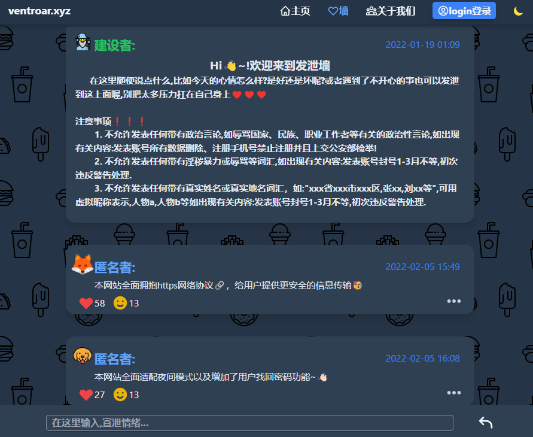

<!-- truncate -->

# 🥳 VentRoar!!!

## VentRoar 是用 **`React`** 库构建的发泄墙网站

## 1、react 简介

:::tip

React 是用于构建用户界面的 JavaScript 库，
起源于 Facebook 的内部项目，该公司对市场上所有 JavaScript MVC 框架都不满意，
决定自行开发一套，用于架设 Instagram 的网站。于 2013 年 5 月开源。

:::

## 2、网站介绍:

:::tip

在这个网站上可以发泄最近遇到的不开心的事情，发泄到这上面，此网站用匿名的方式可以和别人交流倾诉最近遇到的不开心 😊😊😊

:::

## 3、项目依赖介绍:

- 1、<a href="https://tailwindcss.com/">`Tailwindcss3.0`</a>:是一个偏向于用 class 方式供开发者使用的 css 框架:无需离开 HTML 即可快速构建现代网站(摘于 tailwindcss3.0 网站标题).

- 2、<a href="https://headlessui.dev/">`@headlessui/react`</a>:用于处理网站内的大部分 UI 交互逻辑组件库.

- 3、<a href="https://heroicons.com/">`@heroicons/react`</a>:一个含有 230 余个图标的图标组件库.

- 4、<a href="https://github.com/remix-run/react-router">`react-router-dom`:</a> react 官方的路由功能库,大部分路由逻辑都使用的是 react-router-dom 里的组件,此项目使用的是 v6 版.

- 5、<a href="https://react-spring.io/">`react-spring`</a>:部分动画效果的实现,都是利用 react-spring 完成.

- 6、<a href="https://github.com/fkhadra/react-toastify">`React-Toastify`</a>:页面消息通知栏功能的实现,都是利用 React-Toastify 完成.

## 4、项目快速部署方法 Quick start🚀🚀🚀

:::info

> 1-克隆此项目到本地 ✨

:::

```bash
git clone https://gitee.com/xiao-kang-zhang/vent-roar.git
//克隆此项目文件
```

:::info

> 2-进入到克隆好的项目路径内,并安装本地依赖 ✨

:::

```bash
cd vent-roar
//进入到克隆好的项目目录里
npm install
//安装项目依赖库
```

:::info

> 3-启动 vite 自带开发服务器 ✨

:::

```bash
npm run dev
//开启开发服务器
```

> 4 开启服务,进入 http://localhost:3000 🎉

## 5、demo 👻 图骗

暂无......

:::caution

😢 因为还没正式公布此网站，还有很多工作等待完成，过多细节就不透露了 🤪，不过应该可以在此月底发布上线，做 ventroar 这个网站我并没有冲着盈利的念头去做，
完完全全就是想试一下自己的技术到底是什么样的 😽 一个程度，不过网站上线后可能也有很多的功能没有，后续我还会继续进行网站功能的更新，自己一个人能力有限还望大家见谅
，刚好也可以当作一个制作网站项目的技术积累，我很开心 😊

:::

<!--



 -->

## 6、下篇博客预告

:::tip

因为答应了一个哥们，下篇博客大概率是分享一些`python`编程语言的技术干货、编写`css`代码时应该注意的事项、如何保持干净的方便后期维护的代码技巧

```python
print("下篇博客见~👋")
```

:::
